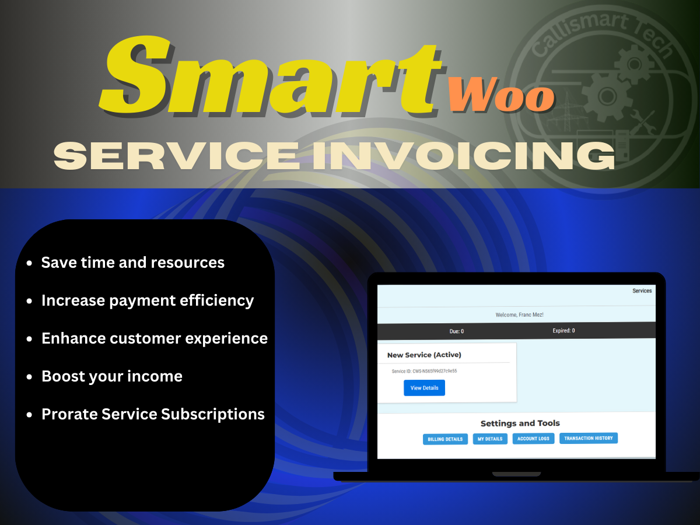

# Smart Woo Service Invoicing. 

Integrate powerful service subscriptions and invoicing directly into your online store! This plugin is born out of the need for a robust, cost-effective billing solution customized for freelencers offering diverse services.

## Introduction

As a freelancer, automating service management and billings can be hectic, there are times you need to have specific clients on certain billing cycles and so on. Traditional options were often expensive and complex. This inspired me to develop the Smart Woo Service Invoicing Plugin, a WooCommerce extension designed to streamline service subscriptions and invoicing within your online store.

## Features

- **Dedicated Product Type:** Has dedicated product type designed for subscription

- **Flexible Billing Cycles:** Charge Monthly, Quarterly, Six Monthly and Yearly service subscription periods.

- ** Empower customers to set their service name, billing cycle and other relevant data during the purchase (sign-up) process.

- **Easy Service Order Management:** All orders for this product type are considered New Service Orders, allowing easy processing via the Service Orders page in the admin.

- **Automatic Invoice Generation:** Auto generates new invoice(s) at the end of each billing cycle making the whole management process seamless.

- **User-Friendly Pages:** Dedicated frontend pages for Service Management and Invoice Management for clients using shortcodes.

- **Admin Notifications:** Get notified of service purchases, renewals, expirations, and stay informed about your subscriptions.

- **Stats and Usage:** You are incharge, monitor subscription stats and usages right from the admin dashboard, your client will also be able to view same stats for transparency.

- **Prorate Service Subscriptions:** You have the option to prorate your subscription and reflect same in your invoicing system.
- **Service Subscription Migration:** Flexible options to allow clients to migrate from their current subscription to another right from their dashboard.

- **Mini containers:** Show Invoices and subscriptions of the current user in mini card or containers using shortcodes.

## License

This project is licensed under the GPL- v3.0+ License.

## Screenshots

## Prerequisites

- **WordPress**: Ensure that your WordPress installation is version 6.4 or later.

- **WooCommerce**: Smart Woo Service Invoicing requires WooCommerce to be installed and activated on your WordPress website. For optimal performance, be sure to have WooCommerce version 8.0.0 or later.

- **PHP**: This plugin requires PHP version 7.0 or later. Verify that your hosting environment meets this requirement.

- **SQL**: Ensure that your database supports at least MySQL version 5.6 or MariaDB version 10.0.

## Installation

1. Download the plugin zip file.
2. Upload the plugin to your WordPress site plugin directory.
3. Activate the Smart Woo Service and Invoicing Plugin from the WordPress plugins page.

Alternatively, you can install the plugin directly from your WordPress dashboard:
1. Go to 'Plugins' -> 'Add New'.
2. Search for 'Smart Woo Service and Invoicing'.
3. Install and activate the plugin.

For more details and updates, visit the [Smart Woo Service and Invoicing Plugin page](https://callismart.com.ng/smart-woo).

## Usage

1. Create a 'Service Product' from the plugin's service product page.
2. Set billing cycles, sign-up fees, and other parameters specific to the service you offer.
3. Customers can now personalise their service details during sign-up.
4. Manage orders effortlessly through the Service Order page.
5. Automatic invoice generation simplifies the renewal process.

## Feedback and Contributions

We welcome and appreciate user suggestions! Feel free to submit your ideas or report issues. Together, we can make Smart Woo the ultimate solution for service billing on WooCommerce.

## Author

- **Author:** Callistus Nwachukwu
- **Company:** Callismart Tech

## Contributors

- Callistus Nwachukwu
- Callismart Devs team

## Changelog

See [changelog.md](changelog.md) for details on updates and changes.

## Support

For support, please visit the [support portal](https://callismart.com.ng/support-portal).

## Financial Support

If you find Smart Woo Service and Invoicing Plugin valuable and would like to support our team in providing technical support, continuous improvement, and keeping the plugin free for everyone, you can contribute by making a financial donation.

Your support helps us cover development costs, server expenses, and dedicate more time to enhancing the plugin. We appreciate any amount you can contribute.

To make a donation, please visit our [donation page](https://paystack.com/pay/support-smart-woo-dev).

Thank you for considering supporting Smart Woo Service and Invoicing Plugin! Your generosity is crucial to the sustainability and improvement of this project.

**Tags:** Invoice,Invoicing, Subscription,WHM, WordPress invoicing plugin,