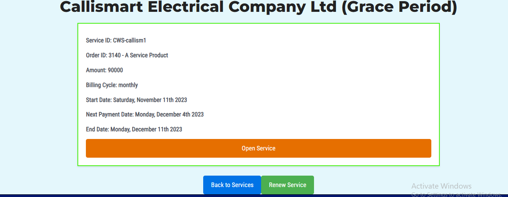

# Smart Woo Service and Invoicing Plugin

Revolutionise your WooCommerce experience with the Smart Woo Service and Invoicing Plugin! This plugin is born out of the need for a robust, cost-effective billing solution tailored for web developers offering diverse services.

## Introduction

As a web developer, I struggled to find an affordable and comprehensive billing solution for my clients. Traditional options were often expensive and complex. This led me to develop the Smart Woo Service and Invoicing Plugin, a WooCommerce extension designed to streamline service subscriptions and invoicing within your online store.

## Features

- **Dedicated Product Type:** Introduce a new 'Service Product' type indexed on the WooCommerce product page.
- **Flexible Billing Cycles:** Set billing cycles, sign-up fees, and grace periods on dedicated products.
- **User Personalisation:** Empower customers to set their service names and other relevant data during the purchase (sign-up) process.
- **Effortless Management:** All orders for this product type are considered new Service Orders, allowing easy processing via the WooCommerce order edit page.
- **Automatic Invoice Generation:** At the end of each billing cycle, a new invoice is automatically created for subscription renewal.
- **User-Friendly Pages:** Two dedicated pages for Service Management and Invoice Management for clients.
- **Admin Notifications:** Get notified of service expirations and stay informed about your subscriptions.

## Screenshots

## Installation

1. Download the plugin zip file.
2. Upload the plugin to your WordPress site.
3. Activate the Smart Woo Service and Invoicing Plugin from the WordPress plugins page.

Alternatively, you can install the plugin directly from your WordPress dashboard:
1. Go to 'Plugins' -> 'Add New'.
2. Search for 'Smart Woo Service and Invoicing'.
3. Install and activate the plugin.

For more details and updates, visit the [Smart Woo Service and Invoicing Plugin page](https://callismart.com.ng/smart-woo).

## Usage

1. Create a 'Service Product' from the WooCommerce product page.
2. Set billing cycles, sign-up fees, and other parameters specific to your service.
3. Customers can now personalise their service details during sign-up.
4. Manage orders effortlessly through the WooCommerce order edit page.
5. Automatic invoice generation simplifies the renewal process.

## Feedback and Contributions

We welcome and appreciate user suggestions! Feel free to submit your ideas or report issues. Together, we can make Smart Woo the ultimate solution for service billing on WooCommerce.

## Author

- **Author:** Callistus Nwachukwu
- **Company:** Callismart Tech

## Contributors

- Callistus Nwachukwu
- Callismart Devs team

## Changelog

See [changelog.md](changelog.md) for details on updates and changes.

## Support

For support, please visit the [support forum](https://callismart.com.ng/support-portal).

## License

This project is licensed under the GPL-2.0+ License.

## Acknowledgments

Thank you for choosing Smart Woo Service and Invoicing Plugin! Your support makes this project possible.
