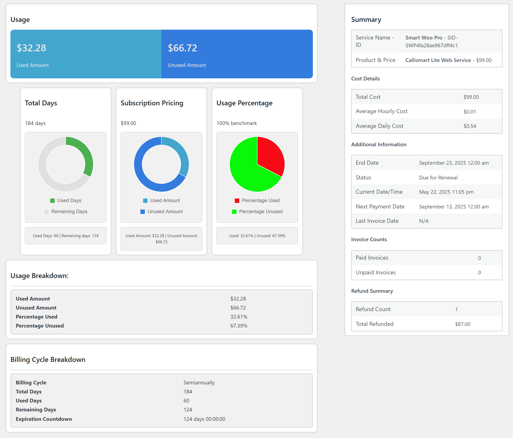

# Smart Woo Service Invoicing

**Author:** [Callistus Nwachukwu](https://github.com/CallismartLtd)

      

**Requires at least:** 6.0  
**Tested up to:** 6.6.2  
**Requires WooCommerce:** 8.0  
**WooCommerce Tested:** 9.3.3
**Requires PHP:** 7.4  
**Stable Tag:** 2.0.13 
**License:** GPLv3  
**License URI:** [https://www.gnu.org/licenses/gpl-3.0.en.html](https://www.gnu.org/licenses/gpl-3.0.en.html)

Integrate powerful service subscriptions and invoicing directly into your online store!

## Description

Smart Woo Service Invoicing simplifies your subscription-based business by automating invoicing at the end of a billing cycle. Perfect for freelancers and agencies, it offers robust features to efficiently manage recurring services without breaking the bank.

## Features

- **Automatic Invoice Generation**: Automatically generates and issues invoices at the end of each billing cycle, making the whole management process seamless.
- **Flexible Billing Cycles**: Charge for Monthly, Quarterly, Six-Monthly, and Yearly service subscription periods.
- **User-Friendly Interface**: Empower customers to set their service name, billing cycle, and other relevant data during the purchase (sign-up) process.
- **Professional Client Portal**: A modern frontend UI allows clients to manage subscriptions, view invoices, and easily pay outstanding balances.
- **Robust Subscription Assets**: Supports downloadable, remote-protected (resource), digital, and physical asset subscriptions.
- **Customized Notifications**: Choose how to receive notifications about service purchases, renewals, expirations, and stay informed about your subscriptions.
- **Stats and Usage**: Monitor service subscription performance directly from the admin dashboard.
- **Automated Refunds**: Provides efficient refund calculations and automatic refunds.
- **Prorated Service Subscriptions**: Option to prorate subscriptions and reflect this in the invoicing system.
- **Service Subscription Migration**: Flexible options allow clients to migrate from their current subscription to another, directly from their dashboard.

## License

This project is licensed under the GPL-v3.0+ License.

## Screenshots

  
  
  

## Prerequisites

- **WordPress**: Ensure your WordPress installation is version 6.0 or later.
- **WooCommerce**: Smart Woo Service Invoicing requires WooCommerce to be installed and activated on your WordPress website. For optimal performance, be sure to have WooCommerce version 8.0.0 or later.
- **PHP**: This plugin requires PHP version 7.4 or later. Verify that your hosting environment meets this requirement.
- **SQL**: Ensure that your database supports at least MySQL version 5.6 or MariaDB version 10.0.

## Installation

1. Download the plugin zip file.
2. Upload the plugin to your WordPress site plugin directory.
3. Activate the Smart Woo Service Invoicing Plugin from the WordPress plugins page.

Alternatively, you can install the plugin directly from your WordPress dashboard:
1. Go to 'Plugins' -> 'Add New'.
2. Search for 'Smart Woo Service Invoicing'.
3. Install and activate the plugin.

For more details and updates, visit the [Smart Woo Service Invoicing Plugin page](https://callismart.com.ng/smart-woo-service-invoicing).

## Usage

1. Create a 'Service Product' from the plugin's service product page.
2. Set billing cycles, sign-up fees, and other parameters specific to the service you offer.
3. Customers can now personalize their service details during sign-up.
4. Manage orders effortlessly through the Service Order page.
5. Automatic invoice generation simplifies the renewal process.

## Feedback and Contributions

We welcome and appreciate user suggestions! Feel free to submit your ideas or report issues. Together, we can make Smart Woo the ultimate solution for service billing on WooCommerce.

## Author

- **Author:** Callistus Nwachukwu  
- **Company:** Callismart Tech

## Contributors

- Callistus Nwachukwu

## Changelog

# [2.0.13] 2024-10-05

### Added
- Ajax logout feature on the invoice and service pages.
- Invoices by status filtering for users.

### Fixed

- Admin search feature not working for mariaDB users.
- New service purchase template now available for logged out users.
- Minor bug fixes.

For detailed updates and changes, see the [Changelog](https://github.com/CallismartLtd/smart-woo-service-invoicing/blob/main/changelog.md).

## Source Code

The source code for the Smart Woo Service Invoicing plugin can be found on our official [GitHub Public Repository](https://github.com/CallismartLtd/smart-woo-service-invoicing).

## Technical Support

We are dedicated to providing an excellent user experience and invest significant effort to ensure our product is safe and free of bugs. However, we understand that issues may arise, and we are committed to addressing them promptly.

For dedicated support, please visit our [support portal](https://callismart.com.ng/support-portal). This portal is not intended for general inquiries; please use the [WordPress Support](https://wordpress.org/support/plugin/smart-woo-service-invoicing) forum for that purpose.
